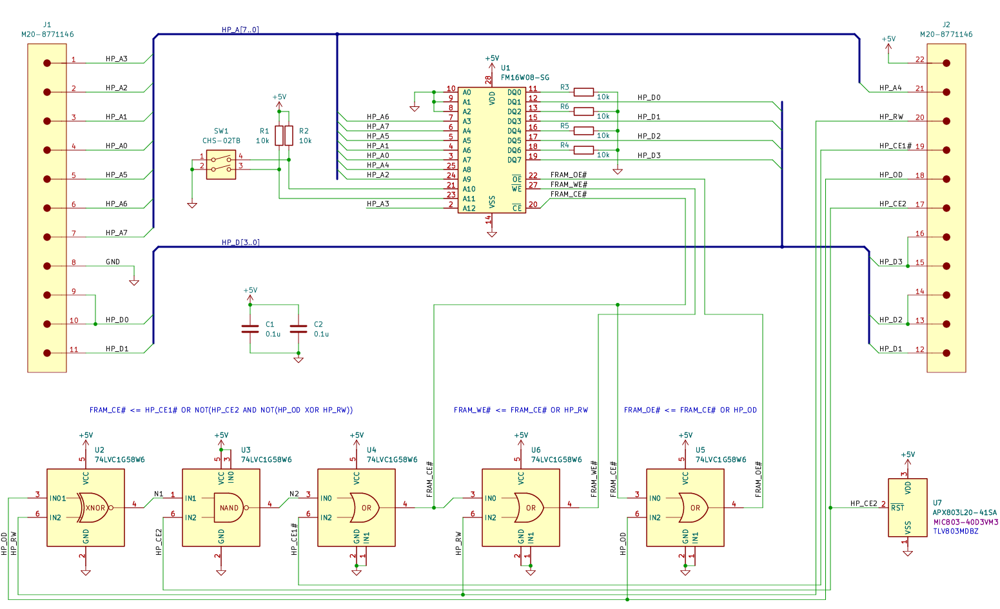

= hp-3478a-fram

Yet another HP 3478A calibration RAM replacement using FRAM.

== Main changes

* One resistor value (10k) and one capacitor value (10k) - both 0603.
* One gate IC - *74LVC1G58* for all logic - SOT-23-6.
* Smaller size (0.70" x 1.15").
* Voltage supervisor changed to *xxx**803*** variants with ~4V cutoff.

== Notes

* For 0.1" DIP SMT pins, match the pin plating (gold/tin) to the socket plating. Plating does not matter if soldering directly.
* The µPD5105L RAM uses a 0.4" DIP width. Choose an appropriately sized socket if using one.
* The 803 voltage supervisors are available in multiple pinout configurations. Carefully verify the pinout when selecting alternatives not listed.

== Ordering
* US / Canada: OSHPark https://oshpark.com/shared_projects/5y6FeQE9[Order Link]
* China: JLCPCB https://jlcpcb.com/quote[Upload Gerbers from release folder]

=== Schematic (Rev1)

=== PCB (Rev1)

[cols="a,a", frame=none, grid=none]
|===
| image::README.assets/image-20260909163140836.png[width=300]
| image::README.assets/image-20260909163228986.png[width=300]
|===

=== BOM (Rev1)

[cols="1,2,1,2,4,3,3,3",options="header"]
|===
| # | Reference | Qty | Value | Description | Manufacturer | MPN | Alternate PN

| 1
| C1,C2
| 2
| 0.1u
| CAP CER 0.1UF 50V X7R 0603
| Murata Electronics
| GCM188L81H104
| KGM15BR71H104KT

| 2
| J1,J2
| 1
| M20-8771146
| CONN HEADER SMD 11POS 2.54MM
| Harwin Inc
| M20-8771146
| PZ254VS-11-11P

| 3
| R1,R2,R3,R4,R5,R6
| 6
| 10k
| RES 10K OHM 1% 1/10W 0603
| Vishay Dale
| CRCW060310K0FKEA
| RK73H1JTTD1002F

| 4
| SW1
| 1
| CHS-02TB
| SWITCH SLIDE DIP SPST 0.1A 6V
| Nidec Components
| CHS-02TB
| DHA-02NTQR

| 5
| U1
| 1
| FM16W08-SG
| IC FRAM 64KBIT PARALLEL 28-SOIC
| Infineon Technologies
| FM16W08-SG
| N/A

| 6
| U2,U3,U4,U5,U6
| 5
| 74LVC1G58W6
| IC MF/CFG 1-CIR 3-IN SOT-23-6
| Diodes Inc
| 74LVC1G58W6-7
| SN74LVC1G58DBV

| 7
| U7
| 1
| APX803L20-41SA
| IC SUPERVISOR 1CH 4.0V SOT-23
| Diodes Inc
| APX803S-40SR-7
| MIC803-40D3VM3
|===

