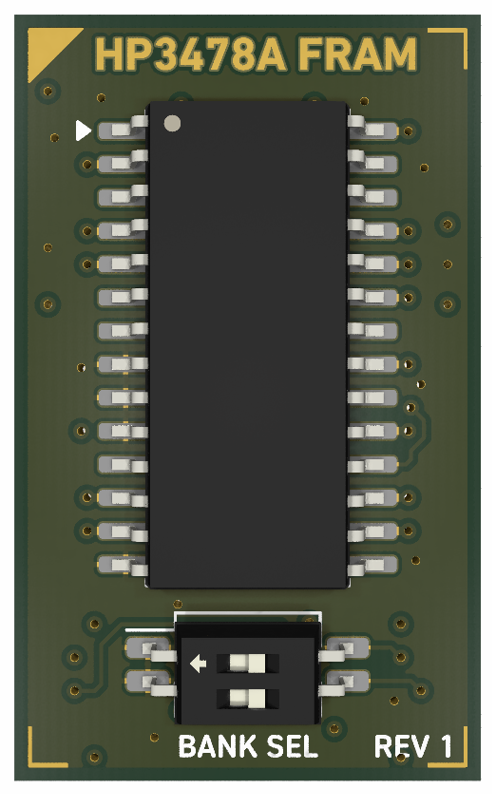
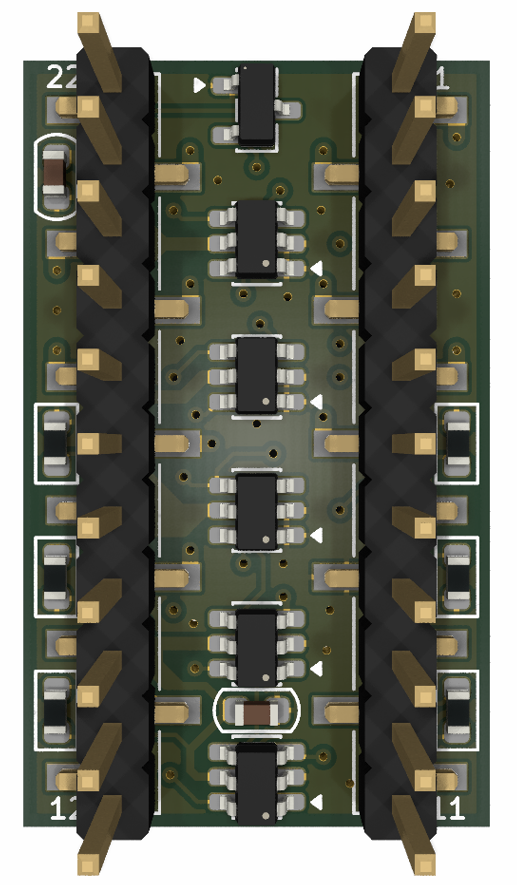

# hp-3478a-fram
Yet another HP 3478A calibration RAM replacement using FRAM.

Main changes:

* One resistor value (10k) and one capacitor value (10k) - both 0603.
* One gate IC - _74LVC1G58_ for all logic.
* Smaller size (0.70" x 1.15").
* Voltage supervisor changed to xxx803 variants.

### Schematic (Rev1)

### PCB (Rev1)

### BOM (Rev1)

| # | Reference         | Qty | Value          | Description                     | Manufacturer          | MPN              | Alternate PN    |
|---|-------------------|-----|----------------|---------------------------------|-----------------------|------------------|-----------------|
| 1 | C1,C2             | 2   | 0.1u           | CAP CER 0.1UF 50V X7R 0603      | Murata Elecronics     | GCM188L81H104    | KGM15BR71H104KT |
| 2 | J1                | 1   | M20-8771146    | CONN HEADER SMD 11POS 2.54MM    | Harwin Inc            | M20-8771146      | PZ254VS-11-11P  |
| 3 | J2                | 1   | M20-8771146    | CONN HEADER SMD 11POS 2.54MM    | Harwin Inc            | M20-8771146      | PZ254VS-11-11P  |
| 4 | R1,R2,R3,R4,R5,R6 | 6   | 10k            | RES 10K OHM 1% 1/10W 0603       | Vishay Dale           | CRCW060310K0FKEA | RK73H1JTTD1002F |
| 5 | SW1               | 1   | CHS-02TB       | SWITCH SLIDE DIP SPST 0.1A 6V   | Nidec Components      | CHS-02TB         | DHA-02NTQR      |
| 6 | U1                | 1   | FM16W08-SG     | IC FRAM 64KBIT PARALLEL 28-SOIC | Infineon Technologies | FM16W08-SG       | N/A             |
| 7 | U2,U3,U4,U5,U6    | 5   | 74LVC1G58W6    | IC MF/CFG 1-CIR 3-IN SOT-23-6   | Diodes Inc            | 74LVC1G58W6-7    | SN74LVC1G58DBV  |
| 8 | U7                | 1   | APX803L20-41SA | IC SUPERVISOR 1CH 4.0V SOT-23   | Diodes Inc            | APX803S-40SR-7   | MIC803-40D3VM3  |

